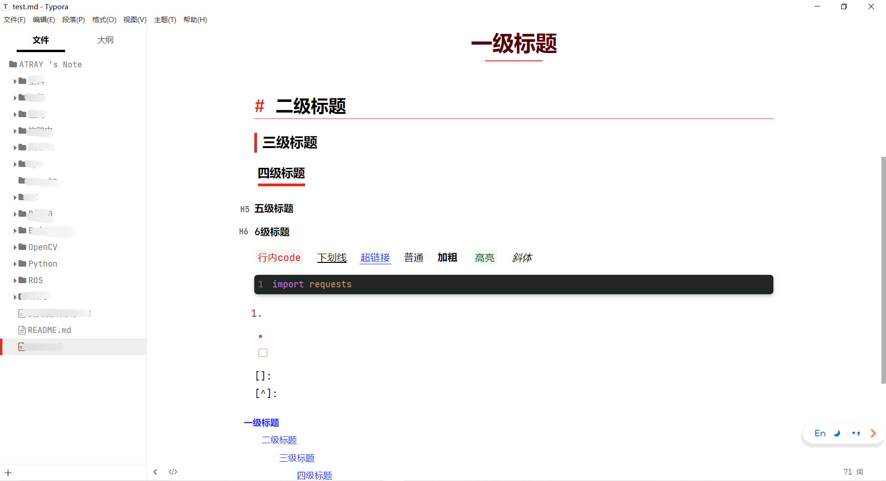

# 写的是艺术

  
   
   
  <a href="https://raw.githubusercontent.com/Angels-Ray/my_typora_theme/main/atray_theme.zip">下载</a>
  | <a href="https://github.com/Angels-Ray">GITHUB</a>
   

 

## 自定义

**字体大小**: <kbd>设置界面</kbd> -> <kbd>外观</kbd> -> <kbd>字体大小</kbd> -> <kbd>设置字体大小</kbd>

 

> 如果发生符号粘连(例如≠), 那是主题内置字体`JetBrainsMono`的特性`ligatures`, 如不喜欢可自行删除

 

## 安装

- [x] 首先确定已安装[Typora](https://typora.io/)

- [ ] 通过`设置 -> 外观 -> 打开主题文件夹`打开theme目录

- [ ] 复制解压后目录内的所有文件到`theme`目录下然后重启, 选择菜单栏 -> 主题即可

## 预览

